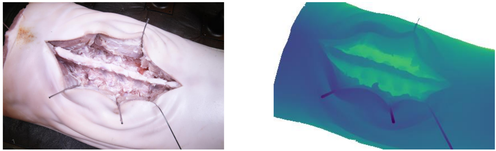
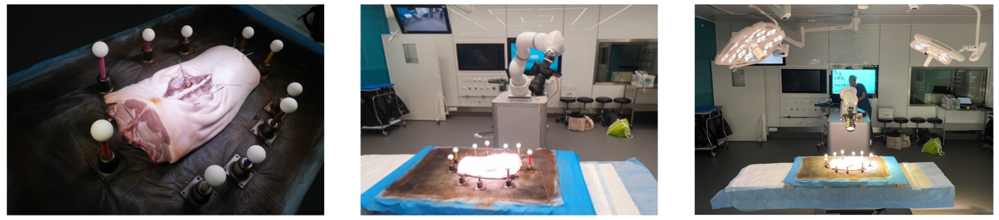
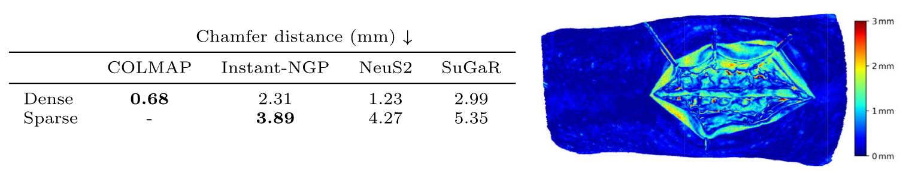

# Acquiring submillimeter-accurate multi-task vision datasets for computer-assisted orthopedic surgery

**Authors:** Emma Most, Jonas Hein, Frédéric Giraud, Nicola A. Cavalcanti, Lukas Zingg, Baptiste Brument, Nino Louman, Fabio Carrillo, Philipp Fürnstahl and Lilian Calvet

**Conference:** IPCAI 2025

[📄 Read the paper](https://rdcu.be/el5Jj)  
[💻 Code on GitHub](https://github.com/emmamost26/CAOS3D_v0)   
[📄 View the Poster](assets/poster.pdf)   
[📚 Citation](#citation) 

---

## Abstract

Advances in computer vision, particularly in optical image-based 3D reconstruction and feature matching, enable applications like marker-less surgical navigation and digitization of surgery. However, their development is hindered by a lack of suitable datasets with 3D ground truth. This work explores an approach to acquiring realistic and accurate ex vivo datasets tailored for 3D reconstruction and feature matching in open orthopedic surgery. A set of posed images and an accurately registered ground truth surface mesh of the scene are required to develop vision-based 3D reconstruction and matching methods suitable for surgery. We propose a framework consisting of three core steps and compare different methods for each step: 3D scanning, calibration of viewpoints for a set of high-resolution RGB images, and an optical method for scene registration. We evaluate each step of this framework on an ex vivo scoliosis surgery using a pig spine, conducted under real operating room conditions. A mean 3D Euclidean error of 0.35 mm is achieved with respect to the 3D ground truth. The proposed method results in submillimeter-accurate 3D ground truths and surgical images with a spatial resolution of 0.1 mm. This opens the door to acquiring future surgical datasets for high-precision applications.

---

### 📊 Dataset Sample

  

> We propose a pilot dataset featuring an open pig spine surgery acquired in real surgical conditions. Left: A RGB image sample from our dataset. Right: The corresponding depth map obtained from our submillimeter accurate 3D ground truth.

---

### 🛠️ Acquisition Setup

  

Our setup consists of a specimen fixated onto a wooden board, placed on an operating table, along with a set of 10 spherical registration markers. A clinician makes an incision that is kept open with k- wires. Experiments were made in a fully equipped operating room replica (https://or-x.ch/) to allow for realistic illumination conditions.

  

---

### 🧪 Our Dataset as Benchmark for 3D Reconstruction

We demonstrate the use of our pilot dataset as a benchmark to compare different 3D reconstruction methods from posed images. We evaluated four methods that reconstruct the surface of a scene from posed RGB data. The following methods were evaluated against our ground-truth mesh:

- **COLMAP** (traditional multi-view stereo)  
- **NeuS2** (NeRF-based)  
- **Instant-NGP** (NeRF-based)  
- **SuGaR** (Gaussian splatting-based)

  

> Surface reconstruction errors (mm), measured by Chamfer distance (**lower is better**), are compared to our ground truth across two acquisition scenarios:  
> (i) **Dense** viewpoints (**N = 216**) at a resolution of **3840×2160** pixels  
> (ii) **Sparse** viewpoints (**N = 8**) at **1920×1080** pixels.  
> COLMAP performs best in the dense viewpoint scenario but fails to reconstruct the scene with only 8 viewpoints, in which Instant-NGP shows the best performance.

---

<h2 id="citation">Citation</h2>

<pre><code>@article{Most2025,
  author  = {Emma Most and Jonas Hein and Frédéric Giraud and Nicola A. Cavalcanti and Lukas Zingg and Baptiste Brument and Nino Louman and Fabio Carrillo and Philipp Fürnstahl and Lilian Calvet},
  title   = {Acquiring submillimeter-accurate multi-task vision datasets for computer-assisted orthopedic surgery},
  journal = {International Journal of Computer Assisted Radiology and Surgery},
  volume  = {20},
  number  = {6},
  pages   = {1293--1300},
  year    = {2025},
  doi     = {10.1007/s11548-025-03385-2},
  url     = {https://doi.org/10.1007/s11548-025-03385-2}
}</code></pre>

---

### Acknowledgments

This work has been supported by OR-X—a Swiss national research infrastructure for translational surgery—and associated funding by the University Hospital Balgrist. Additional support was provided by the InnoSuisse Flagship project PROFICIENCY No. PFFS-21-19 and the Swiss Center for Musculoskeletal Imaging. We would like to thank Manuel Saladin for his contributions to the CT segmentation work and Vincent Schorp for assisting with video and photographic documentation of the setup.
